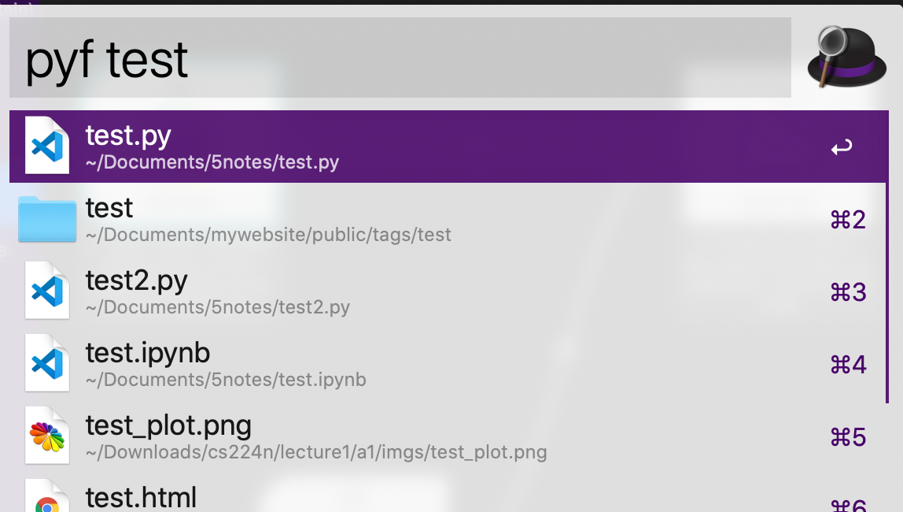
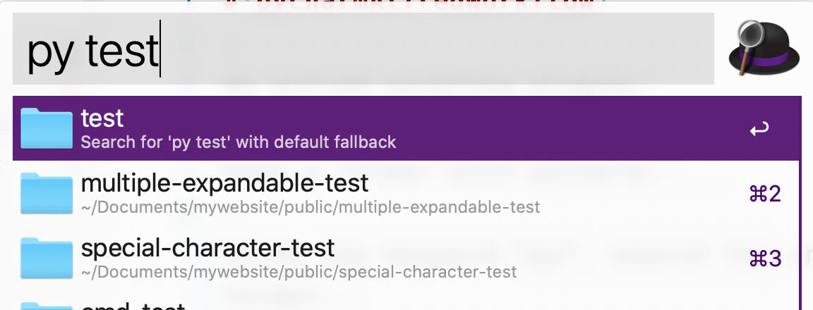

# pycharmAlfredWorkflow

An alfred workflow plugin:

Open a folder with pycharm.

Using the keyword "py", search for only folders within your home folder.

Using the keyword "pyf", search for only files within your home folder.

Hit Return to open the file/folder.

[Download](https://github.com/xiaoouwang/pycharmAlfredWorkflow/raw/main/OpenCharm.alfredworkflow)

